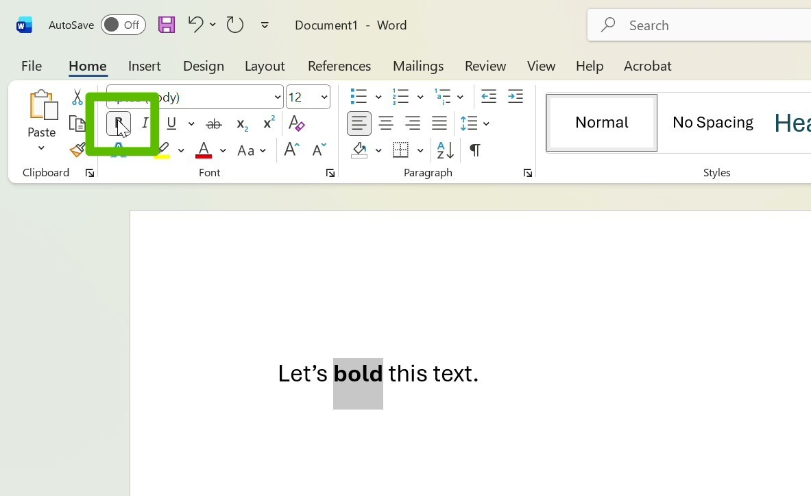

# Advanced STEM Quick-Start Guide

## Intro {-}

:::{style="font-size:0.9rem; margin-top: -1em"}
[Jump to TOC](#as-toc)
:::

Your goal is to use software to transform a text file that looks like the document on the left into a document that looks like the one on the right.


::::{.figure-row}

:::{.figure}
```
---
title: Hello Math
lang: en
---

Here is some math: $\frac{a}{b}$
```
[Markdown]{.figcaption}
:::

:::{.figure}

{{iframe: src="html/hellomath_pretty.html" title="Hello_Math"}}

[Rendered HTML]{.figcaption}
:::

::::

The software that we use to get from the stuff on the left (*Markdown*) to the stuff on the right (rendered *HTML*) will work differently than a lot of applications, like web browsers. Instead of pressing buttons to do things, you'll open a window, type some words, and then click **Enter** to do things.


::::: {.figure-row}

:::: {.figure}
 [In Word, you press a button to perform an action, like make text bold.]{.figcaption}
::::

::::: {.figure}
:::: {.video}
::: {.source src="video/cmd.mp4" type="video/mp4"}
Your browser does not support the video tag.
:::
::::
[When using command line software, you type things then press **Enter** to perform an action.]{.figcaption}
:::::
 
:::::

Specifically, you will use a program called *Pandoc* and you will type something like this to create the final HTML file:

```.zsh
pandoc file.md -s -d defaults.yaml -o  file.html
```

## TOC {-#as-toc}

- \@ref(workflow-overview) [Workflow Overview](#workflow-overview)
- \@ref(markdown) [Markdown](#markdown)
    - \@ref(navigation) [Navigation](#navigation)

## Workflow Overview {#workflow-overview}

HTML is generally considered a more accessible file format than PDF. We are going to start with PDF files and **submit** (accessible) HTML files.

When you visit a website in a web browser, you're viewing an HTML file. Opened in a text editor, an HTML file will look something like:

{{hellomath_simple}}

When the same file is opened with a web browser, the browser will "render" it as:


:::::{.flex}

::::{.figure}
{{iframe: src="html/hellomath_simple.html" title="Hello_Math"}}

:::{.figcaption}
*An HTML file as rendered in a web browser. If a screen reader encounters an HTML file in a web browser, it can also provide audio descriptions of the text and navigate between elements.*
:::

::::

:::::

But we don't want to type out all those HTML tags (like `<head> . . . </head>`) by hand!

Luckily, the problem of being able to write your own HTML without having to type all those pesky tags has been addressed many times before! We will use a program that converts Markdown, which is easy to write and easy to read, into HTML (not easy to write or read).

:::{.back-toc}

[TOC](#as-toc)

:::

## Markdown {#markdown}

### Navigation {#navigation}

To correct the Markdown file, you may want to jump between elements of the same type in the file: from one heading to the next, or between math expressions.

For some elements, like headings, you can do this via the outline panel. For other elements, you may need to search for the Markdown syntax characters in the "Find" box, but you will have to toggle on a setting called **Use Regular Expression** to do so.

For the following rules, your Markdown must be correct if  you want them to work. It is possible to make the pattern matching more forgiving. If you are an advanced user, feel free to adjust them as you see fit.

[**Regular Expression Rules Table**]{id="reg-ex-table"}


|             Inline Math             |      Display Math      |           Heading            |          Image       |
|:-----------------------------------:|:----------------------:|:----------------------------:|:--------------------:|
| [`\$[^\r?\n]+\$`](#inline-math-reg) | (ref:display-math-reg) | [`^#+ [*^\S]`](#heading-reg) | [`!\[`](#figure-reg) |

(ref:display-math-reg) [[[`^\$\$`](#display-math-reg)]{.summ}**Alternate:**`\$\$.+\$\$`]{.details}


:::{.small}
*Microsoft Support Articles that may be helpful for VS Code Find and Replace:*

- [*Microsoft Support | Regular Expressions in Visual Studio*](https://learn.microsoft.com/en-us/visualstudio/ide/using-regular-expressions-in-visual-studio?view=visualstudio)
- [*Microsoft Support | VS Code Find and Replace*](https://code.visualstudio.com/docs/editing/codebasics#_advanced-find-and-replace-options)

:::


:::{.det}
[Display Math]{.summ}
Display math is generally written on its own line and centered like:

{{iframe: src="html/displaymath.html" title="Hello_Math"}}

We will be writing display math in markdown files using the following notation:

```

$$\frac{a}{b}$$


```

[*surrounded by blank lines]{.small}

To jump between (correctly written) display math expressions:

1. Press **Ctrl** + **F**.
2. Press **Alt** + **R** or click the .^*^ button.
3. Type `^\$\$`.
4. Press ↑ or ↓.

:::

:::{.det}
[Inline Math]{.summ}
Inline math is written in line with text:

{{iframe: src="html/inlinemath.html" title="Hello_Math"}}

We will be writing display math in markdown files using the following notation:

```
lorem ipsum $\frac{a}{b}$ lorem ipsum
```

To jump between (correctly written) inline math expressions:

#. Press **Ctrl** + **F**.
#. Press **Alt** + **R** or click the .^*^ button.
#. Type `\$[^\r?\n]+\$`.
#. Press ↑ or ↓.

:::

:::{.det}
[Headings]{.summ}

You can use the outline tool *or* search tool:

#. Outline Tool
    #. Click **OUTLINE** in the Explorer (lefthand sidebar).
    #. Select any heading level to jump to that heading level.
#. Search Tool
    #. Press **Ctrl** + **F**.
    #. Press **Alt** + **R** or click the .^*^ button.
    #. Type `^#+ [*^\S]`.
    #. Press ↑ or ↓.

:::

:::{.det}
[Images]{.summ}

#. Press **Ctrl** + **F**.
#. Press **Alt** + **R** or click the .^*^ button.
#. Type `!\[`.
#. Press ↑ or ↓.

:::

:::{.back-toc}

[TOC](#as-toc)

:::
