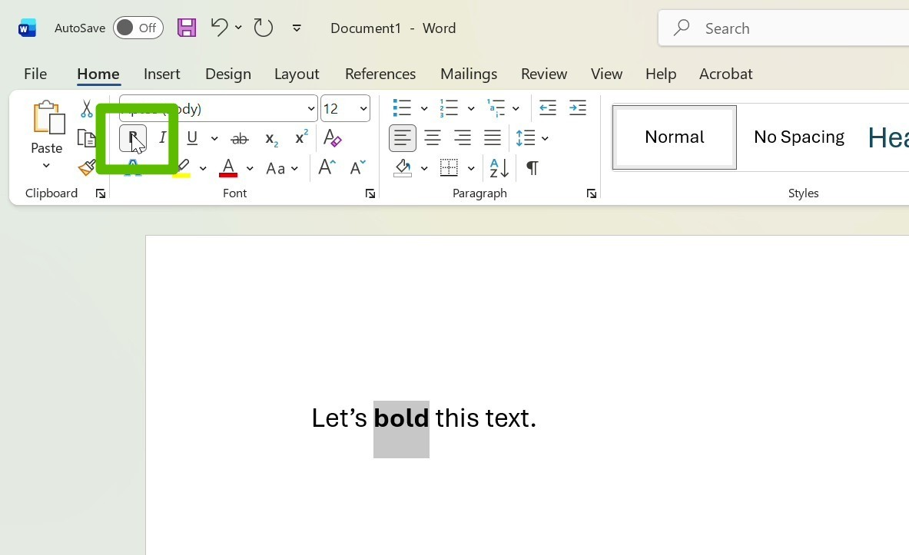

# Advanced STEM Quick-Start Guide {#qs-as}

:::{style="font-size:0.9rem; margin-top: -2em; margin-bottom: 0.5rem"}
[Jump to TOC](#as-toc)
:::

::: {.small}
[*(Syntax highlighting is currently a little jarring. Added for accessibility and to help beginners. Plans to adjust later.)*]{style="margin-top: 3rem"}
:::

## Intro {-#intro-as}

Your goal is to use software to transform a text file that looks like the document on the left into a document that looks like the one on the right.

::::{.figure-row}

:::{.figure}

```markdown
---
title: Hello Math
lang: en
---

Here is some math: $\frac{a}{b}$
```

[**Markdown |** Example filename: file.md]{.figcaption}
:::

:::{.figure}

{{iframe: src="html/hellomath_pretty.html" title="Hello_Math"}}

[**Rendered HTML |** Example filename: file.html]{.figcaption}
:::

::::

The software that we use to get from the stuff on the left (*Markdown*) to the stuff on the right (rendered *HTML*) will work differently than a lot of applications, like web browsers. Instead of pressing buttons to do things, you'll open a window, type some words, and then click **Enter** to do things.


::::: {.figure-row}

:::: {.figure}
 [In Word, you press a button to perform an action, like make text bold.]{.figcaption}
::::

::::: {.figure}
:::: {.video}
::: {.source src="video/cmd.mp4" type="video/mp4"}
Your browser does not support the video tag.
:::
::::
[When using command line software, you type things then press **Enter** to perform an action.]{.figcaption}
:::::
 
:::::

Specifically, you will use a program called *Pandoc* and you will type something like this to create the final HTML file:

```.zsh
pandoc file.md -s -d defaults.yaml -o  file.html
```

## TOC {-#as-toc}
:::{style="font-size:0.9rem; margin-top: -2em"}
[Top](#qs-as)
:::

- \@ref(workflow-overview) [Workflow Overview](#workflow-overview)
- \@ref(markdown) [Markdown](#markdown)
    - \@ref(installation) [Installation](#installation)
    - \@ref(navigation) [Navigation](#navigation)

## Workflow Overview {#workflow-overview}

HTML is generally considered a more accessible file format than PDF. We are going to start with PDF files and **submit** (accessible) HTML files.

When you visit a website in a web browser, you're viewing an HTML file. Opened in a text editor, an HTML file will look something like:

{{hellomath_simple}}

When the same file is opened with a web browser, the browser will "render" it as:


:::::{.flex}

::::{.figure}
{{iframe: src="html/hellomath_simple.html" title="Hello_Math"}}

:::{.figcaption}
*An HTML file as rendered in a web browser. If a screen reader encounters an HTML file in a web browser, it can also provide audio descriptions of the text and navigate between elements.*
:::

::::

:::::

But we don't want to type out all those HTML tags (like `<head> . . . </head>`) by hand!

Luckily, the problem of being able to write your own HTML without having to type all those pesky tags has been addressed many times before! We will use a program that converts Markdown, which is easy to write and easy to read, into HTML (not easy to write or read).

:::{.back-toc}

[TOC](#as-toc)

:::


### Installation

{{sconstruction}}

:::{.back-toc}

[TOC](#as-toc)

:::

## Markdown {#markdown}

:::{.det style="white-space:break-spaces"}

[Pandoc Markdown Cheat Sheet]{.summ}

:::{.figure}

```markdown

# Heading 1

Headings start on a new line, and are marked by a pound sign followed by a space. The next character after the space is the start of the heading text. Headings should be followed by a blank line.

This is a new paragraph.

>To create a blockquote, use the greater-than sign and just keep typing. The blockquote will end wherever you put the line break (with "Enter"), but if you want to continue the blockquote in a new paragraph
>
>
>just use greater-than signs to continue the blockquote.

## Subheading 1

Each time you step in to a new heading level, add another pound sign.

To create a reference, place a unique set of letters and numbers after a caret and wrap it in brackets; we will use just the number 1 to keep it simple.[^1] See the note this references at the end of the Markdown.

## Subheading 2

When you get to an equation, use ("math mode") LaTeX. Wrap inline equations (written in the line of the text) in single dollar signs, like so: $\frac{3}{4}$. Wrap equations that take their own line ("display equations") in doubled dollar signs and place them on a new line, like so:

$$\frac{3}{4}$$

If you have an image, include it using:

{alt="Alt text goes here."}

Note that you need a blank line after. You may leave the caption blank (not put any text between the brackets).

Path/to means the "path" or address of the image. If the file is saved on your computer, that will be folder names separate by slashes; if the file is online, it will be some URL.

*Italics* are created with single asterisks and **bolds** are created with double asterisks.

Create bullet lists ("unordered lists") by starting a new line, and using a hypthen followed by a space for each bullet point. Create nested items by aligning the whitespace:

- Item 1
  - Sub-item 1
- Item 2
- Item 3

Create numbered/lettered lists ("ordered lists") using a pound sign followed by a period then a space for each item; also create sub-items by aligning the whitespace:

#. Item 1
   #. Sub-item 1
#. Item 2
#. Item 3

Links:

[link text](www.example.com)

To create a linked image, use the standard image syntax, and wrap that in brackets []. Place the destination for the link in parenthesis after this.

[](https://www.example.com/)

[^1]: The note is created by using the same label (some unique text, in this case the number 1) preceded by a caret, with everything wrapped in brackets. This is a note rather than a reference though, so we follow it with a colon and a space before the note text.

```

[You can test this using the [Pandoc Online App](https://pandoc.org/app/). Select the **Hello world** example, then paste this in over the text "\*Hello\* world!" and convert. Don't use the web app to convert large loads, and don't paste in personal info or real files you are remediating. [^as_1] ]{.figcaption}

:::


:::

### Math-Mode LaTeX

In Markdown, including Pandoc Markdown, math is written with "math mode" LaTeX. This will often look like a backslash (`\`) followed by some text; the text is then sometimes followed by braces (`{}`). For example, the Greek letter lowercase gamma ($\gamma$) is written as `\gamma`, and the fraction $\frac{a}{b}$ is written as `\frac{a}{b}`, where braces `{}` enclose both the numerator and denominator. 

However, software that processes files written in Markdown needs to know where the math begins and ends so it can handle the math correctly. We use *delimiters* to mark the start and end of math in Markdown.

The standard characters used as delimiters for math in Pandoc Markdown are dollar signs, a single dollar sign for **inline math** and doubled dollar signs for **display math**. (Using `\( . . . \)` for inline and `\[ . . .\]` is supported but requires an extension.)

### Inline Math {-}

Inline math is written in line with text:

{{iframe: src="html/inlinemath.html" title="Hello_Math"}}

We will be writing display math in markdown files using the following notation.:

```latex
lorem ipsum $\frac{a}{b}$ lorem ipsum
```

### Display Math {-}

Display math is generally written on its own line and centered like:

{{iframe: src="html/displaymath.html" title="Hello_Math"}}

We will be writing display math in markdown files using the following notation:

```latex

$$\frac{a}{b}$$


```

::: {.small}
*surrounded by blank lines
:::


### Navigation {#navigation}

To correct the Markdown file, you may want to jump between elements of the same type in the file: from one heading to the next, or between math expressions.

For some elements, like headings, you can do this via the outline panel. For other elements, you may need to search for the Markdown syntax characters in the "Find" box, but you may improve results by toggling on a setting called **Use Regular Expression** to do so.

The following is a table of basic regular expressions to search for different elements in your Markdown file. It is possible to make the pattern matching more forgiving. If you are an advanced user, feel free to adjust them as you see fit.

[**Regular Expression Rules Table**]{id="reg-ex-table"}

::: {style="white-space:nowrap"}

|[Inline Math](#inline-math-reg)|[Display Math](#display-math-reg)|[Heading](#heading-reg)| [Image](#image-reg)  |
|:-----------------------------:|:-------------------------------:|:---------------------:|:--------------------:|
| (ref:inline-math-reg) | (ref:display-math-reg) | `^#+ [*^\S]` | `!\[` |

:::

(ref:inline-math-reg) [[`[^$]\$[^$]`]{.summ}**Alternate:**`[^\$]\$[^(\r?\n|\$)]+\$[^\$]`]{.details}

(ref:display-math-reg) [[`^\$\$`]{.summ}**Alternate:**`\$\$.+\$\$`]{.details}


:::{.small}
*Microsoft Support Articles that may be helpful for VS Code Find and Replace:*

- [*Microsoft Support | Regular Expressions in Visual Studio*](https://learn.microsoft.com/en-us/visualstudio/ide/using-regular-expressions-in-visual-studio?view=visualstudio)
- [*Microsoft Support | VS Code Find and Replace*](https://code.visualstudio.com/docs/editing/codebasics#_advanced-find-and-replace-options)

All regex rules as provided are for the syntax of the advanced workflow, in which we use `$` as the math delimiter. LaTeX also allows `\(` and `\[` as the [delimiters](https://www.overleaf.com/learn/latex/Mathematical_expressions). If you feel comfortable with [Pandoc extensions](https://pandoc.org/demo/example33/8.21-non-default-extensions.html#extension-tex_math_single_backslash), you may use either.

:::

Below, find detailed descriptions of navigating between different elements in a Markdown file in VS Code. Each method has its own limitations and benefits.:

:::{.det}
[Inline Math]{.summ}
Inline math is written in line with text:

{{iframe: src="html/inlinemath.html" title="Hello_Math"}}

We will be writing display math in markdown files using the following notation.:

```latex
lorem ipsum $\frac{a}{b}$ lorem ipsum
```

To jump between (correctly written) inline math expressions:

- Find Tool—Standard Search
  #. Press **Ctrl** + **F**.
  #. Type <code>&nbsp;$</code>.*
  #. Press ↑ or ↓.
  
   <small>*This will only work when the inline math is directly preceded by a space.</small>
- Find Tool—Regular Expression
  #. Press **Ctrl** + **F**.
  #. Press **Alt** + **R** or click the .^*^ button.
  #. Type `[^\$]\$[^(\r?\n|\$)]+\$[^\$]`.
  #. Press ↑ or ↓.

:::

:::{.det}
[Display Math]{.summ}
Display math is generally written on its own line and centered like:

{{iframe: src="html/displaymath.html" title="Hello_Math"}}

We will be writing display math in markdown files using the following notation:

```latex

$$\frac{a}{b}$$


```

[*surrounded by blank lines]{.small}

To jump between display math expressions:

- Find Tool—Standard Search 1
   #. Press **Ctrl** + **F**.
   #. Type `$$`.
   #. Press ↑ or ↓.
- Find Tool—Standard Search 2
   #. Press **Ctrl** + **F**.
   #. Press **Ctrl** + **Enter**.
   #. Type `$$`.
   #. Press ↑ or ↓.
- Find Tool—Regular Expression
   #. Press **Ctrl** + **F**.
   #. Press **Alt** + **R** or click the .^*^ button.
   #. Type `^\$\$`.
   #. Press ↑ or ↓.

:::

:::{.det}
[Headings]{.summ}

You can use the outline tool *or* search tool:

- Outline Tool
    #. Click **OUTLINE** in the Explorer (lefthand sidebar).
    #. Select any heading level to jump to that heading level.
- Find Tool—Standard Search
    #. Press **Ctrl** + **F**.
    #. Press **Ctrl** + **Enter**.
    #. Type `#`.
    #. Press ↑ or ↓.
- Find Tool—Regular Expression
    #. Press **Ctrl** + **F**.
    #. Press **Alt** + **R** or click the .^*^ button.
    #. Type `^#+ [*^\S]`.
    #. Press ↑ or ↓.

:::

:::{.det}
[Images]{.summ}

#. Press **Ctrl** + **F**.
#. Press **Alt** + **R** or click the .^*^ button.
#. Type `!\[`.
#. Press ↑ or ↓.

:::

:::{.back-toc}

[TOC](#as-toc)

:::

## Pandoc Processing

For now, you will place the file [STARS Pandoc Template](html/template.html) in your working directory and process your Markdown file `filename.md` with the command:

::: {style='margin: 1rem'}
```bash
pandoc file.md -s --mathml --filter pandoc-crossref  -o  file.html  --template="template.html" --embed-resources --toc
```
:::

That is, the above is the command you will type into your terminal in VS Code. 

::: {.det}

[Example]{.summ}

As an example, if your file is named `nebula.md`, then you would type

```bash
pandoc nebula.md -s --mathml --filter pandoc-crossref  -o  nebula.html  --template="template.html" --embed-resources --toc
```
:::

**If you previously used starsMJ.txt and the `--mathjax` option, please stop and switch to this method. We want to use MathML with MathJax layered on top, not MathJax on its own.** Instead, open the above link to the STARS Pandoc template, and then save the page as `template.html`.

*These instructions will change significantly in the coming weeks, so please check in regularly for updates.*


::: {.det}
[**Advanced Method—Windows**]{.summ}

{{backup}}

<small>*Instructions assume Powershell as the VS Code terminal.*</small>

#. Configuration Files

   You will save two configuration files to your computer that will be used every time you convert Markdown to HTML, and one example Markdown file that is only being used to demonstrate the process.
  
   Save these files to the locations indicated in the next step.
   - [template.html](html/template.html)
   - [defaults.yaml](Supplements/defaults/defaults.yaml)
   - [example.md](example/example.md)
   - [filler.png](image/filler.png)
<br/><br/>
  
   To save:
   - Open each file in a new tab
   - Right-click anywhere in the new tab
   - Click **Save Page As**
   - Navigate to the correct directory
   - Change *Save as type* to **All Files**.
   - Type the full filename, including the extension
   - Click **Save**
<br/><br/>

#. Directory Setup
   
   Create the following directory structure in `Documents` of your current user profile:

    ```
    Documents/
    ├── VS Code/
        ├── STARS/
            ├── Supplements/
            |   ├── templates/
            |   |   ├── template.html
            |   └──defaults/
            |       ├── defaults.yaml
            └── Document 1/
                ├── example.md
                └── filler.png
    ```
    
    You may disregard the STARS folder under Documents if you wish and you will only be using VS Code for STARS work.
#. VS Code Setup

   In VS Code:
    #. Open the folder `Document 1`.
    #. Optionally, open the file `example.md`
    #. Open the terminal.
<br/></br>

#. File Processing

   Then, in the terminal, use the command:
    
    ```powershell
    $myFile='example'
    pandoc "$myFile.md" -o '$myFile.html' -d defaults.yaml --data-dir "../Supplements"
    ```
    
    <small>If you need to reprocess the same file while in the same session, only run the second line again. If you want to save multiple output versions, change `myFile.html` each time, or set that in a variable as well. The only part you need to change when you process a new file is the first line, to set the new filename.</small>
    
    <small>Remember not to include the file extension when setting `$myFile`.</small>
    
#. Make it Easier

   ::: {.det}
   
   [Super Advanced Method]{.summ}
   <small>*The following definitions assume you have used the above folder structure.*</small>
   
   <small>*This process makes the VS Code offshoot of the STARS markdown workflow easier, but **only** use it if you are certain you are comfortable with the process.*</small>
  
   If you want to make this easier, you can store a Powershell function and alias  for said function in a Powershell profile, so that every time you process a file you only have to type `dazzle $myFile`.
  
   In VS Code:
  
    #. Install the [VS Code Powershell extension](https://marketplace.visualstudio.com/items?itemName=ms-vscode.PowerShell).
    
    #. Create a VS Code Powershell profile:
       #. In VS Code terminal, run the following:
       
       
           ```powershell
           code $PROFILE
           ```
    
        #. Define a function `Remediate-File` and an alias `dazzle` for it:
           
           The last code opened a new temporary file in the VS Code editor. Type the following in this file, then press **Ctrl + S** to save.
           
           ```powershell
           function Remediate-File {
            pandoc "$myFile.md" -o "$myFile.html" --data-dir "../Supplements" -d "defaults.yaml"
           }
        
           Set-Alias dazzle Remediate-File
           ```
    
    #. Use the alias to remediate files.
       
       Now, whenever you want to remediate a file, open the working directory for that file, and then use a two-part process:
       #. Place the filename (sans extension) in a variable.
       
          <small>*You can skip this step and just put the filename in place of the variable in the next step, but if you want to create multiple processing Powershell functions and test them on files with longer filenames (that you don't wish to change), this can be helpful.*</small>
          
          ```powershell
          $myFile='FILENAME_GOES_HERE`
          ```
          
          In the above, replace the characters FILENAME_GOES_HERE with the correct filename, leaving the quotes in-place.
          
       #. Process the file.
       
           <small>*Run the following command, exactly as written (no substitutions)*</small>
           
           
          ```powershell
          dazzle $myFile
          ```
   :::
:::   

[^as_1]: For more examples of Markdown, look at files ending in *.Rmd* in the code section for [this repository](https://github.com/AlexaMurray-jpg/a11y). To see the output, compare these files with the page of this site that has the same top heading. Note that I use some custom syntax. For additional help, see [Pandoc Markdown Syntax Documentation](https://pandoc.org/MANUAL.html#pandocs-markdown) **or** [Pandoc-Crossref Documentation](https://lierdakil.github.io/pandoc-crossref/) if you are using pandoc-crossref.
