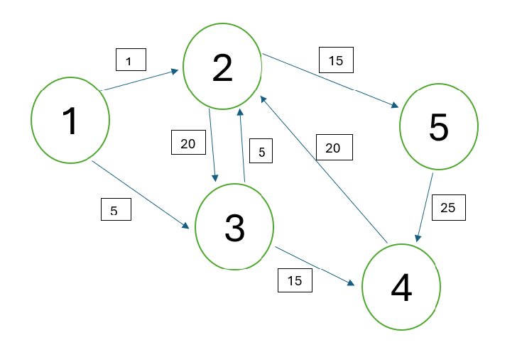

# Knowledge Base
<small>(*Mini Knowledge Base*)</small>

A collection of known solutions for remediation issues we regularly encounter in document remediation!

Sections:

- Tech: How-To
- Tech: What-To
- Content: What-To

**Tech: How-To** tells you how to do a remediation-task with tech when you already know what to do (*I want to create a link but I can't find the button*). 

**Tech: What-To** tells you what to do when you encounter a tech-related remediation problem for the first time (*I found a broken link in a document . . . does that change how I tag it?*). 

**Content: What-To** tells you what accessibility structures we prefer to use for specialty topics (*There's a network diagram in this computer science homework . . . what do I put for the alt text? Is alt text enough?*)

## Tech: How-To

*Windows operating system instructions.*

### PDF: Acrobat

Delete a link

: 1. Exit any open tools. (*Edit* tool, *Reading Order* tool . . .)
  2. Right-click the linked content (words, images).
  3. Select **Delete Link** from the context menu.
  <li> As needed, either:
       <ul>
        <li> Recreate the link. </li>
        <li> Adjust the link tags and containers in “Accessibility tags” panel and “Content” panel. </li>
       </ul>
   </li>

Edit a link (change a link’s destination)

: #. Exit any open tools. (*Edit tool*, *Reading Order* tool . . .)
  #. Right-click the linked content (words, images).
  #. Select **Edit Link** from the context menu.
  #. Select the **Actions** tab in the *Link Properties* dialog box.
  #. Select **Open a web link** (not the URL), then click **Edit**.
  #. Change the URL text.
  #. Click **OK**.
  
Export An Image from a PDF

: *(Potentially needed when rebuilding PDFs.)*

  At times, you might just screenshot an image when rebuilding PDFs. However, retaining image quality can be important for AT users with partial sight.
  
  #. Exit any open tools.
  #. Click the image to select it.
     *(Will be highlighted in blue.)*
  #. Right-click the image.
  #. Choose **Save image as** from the context menu.
  
### Microsoft Office Word

<dl>

<dt> Add a Math Expression </dt>

<dd>

Paste in MathML from Mathpix.

#. Open the Mathpix Desktop App.
#. Take a snip using the snipping tool.
#. Copy *MathML (Ms Word)* from the **Data** tab.
#. Paste anywhere in the Word document.
    - You do not need to insert an empty equation first; just place your cursor anywhere before pasting.

</dd>

<dd>

Use the Word ribbon.

#. From **Home** tab, choose **Insert** > **Equation**.
#. A new tab, **Equation** appears. From this tab:
   - Add mathematical symbols.
   - Add mathematical structures.
      <small>*Example: an exponent, with an empty placeholder in the base and empty placeholder in the exponent.*</small>
   - Fill structures with mathematical symbols.
   - Type math using LaTex or UnicodeMath.
     #. Select input method (LaTeX or UnicodeMath) from the ribbon.
     #. Type the math using LaTeX or UnicodeMath in empty equation placeholder boxes.
         <small>*Once you navigate out of the math equation box, it will automatically convert to the type of math we want.*</small>
   - Correct math using Linear Mode.
     #. Select input method (LaTeX or UnicodeMath) from the ribbon.
     #. Siwtch to Linear Mode using the three-dot menu on the equation box.
     #. Edit the math by typing LaTeX or UnicodeMath.
     #. Switch back to Professional Mode using the three-dot menu on the equation box.
         <small>*Linear Mode can also be used to display LaTeX or UnicodeMath syntax, when that is the end goal for a document.*</small>
        
</dd>

</dl>
  
## Tech: What-To

Broken link

: - Solution 1

      - Set link alternate text or display text (whichever applies) to the title of the original target destination.
      - Add “link broken” to link alternate text 
        - broken links may not be announced clearly
          - some broken links such as [404 errors](https://developer.mozilla.org/en-US/docs/Web/HTTP/Reference/Status/404) will likely be announced clearly
          - others may not
        - AT should correclty announce where a link goes for security reasons
          (If a link no longer goes to the page it was supposed to go to, an AT user should know that before opening)
      - *STARS only: Report broken links to GAA.*

## Content: What-To

<dl>

<dt> Complicated Graphics </dt>

<dd>

::: {.subj-tag}

  - Subject Tags:
    - All
  
:::

General Solution:

- Basic alt text.
- More descriptive caption with reference to endnote.
- Endnote with structured information (lists, tables, paragraphs, etc).
  - Maintain page numbers of original document.
  - Additional structures should go at end of document.
  - Lets AT users discuss page numbers of content with others.
    - Important for discussion sections in academic settings.

</dd>

<dt>Network Diagram/Graph - directed, weighted</dt>

<dd>
::: {.subj-tag}

  - Subject Tags:
    - Computer Science [CPSC]
    - Mathematics \[MATH]
  
:::

- Solution 1:

  Exercise asks for an *adjacency matrix.*

  - Instructions:
    - Alt text and caption from *Complicated Graphics > General Solution*.
    - Endnote with list of tables for each node, with columns *Directed Toward* and *With Weight.*
  - Example:
    
    ::: Figure 
    
    [Weighted network with node set V consisting of nodes ${1,2,3 . . . 5}$. The nodes in V are related to each other via directed arrows with origin, end, and weights described in endnote. ^reference^ ]{.figcaption}
    :::
    
    Alt Text: A directed, weighted network visualized as a collection of numbered circles connected by numbered arrows.
    
    Endnote:
    
    - Node 1

      Directed To   Weight
      ------------- --------
      2             1
      3             5
    
    - Node 2
    
      Directed To   Weight
      ------------- --------
      3             20
    
    - Node 3
    
      Directed To   Weight
      ------------- --------
      2             5
      4             15
    
    - Node 4
    
      Directed To   Weight
      ------------- --------
      2             20
    
    - Node 5
    
      Directed To   Weight
      ------------- --------
      4             25

         
         

</dd>

Music Score
  : Attach a MusicXML file for each staff in the score.
  
    - Include each staff in the primary document as an image.
    - Give the image summary alt text. (Include key signature/unpitched status, time signature, number of measures, inclusion of pickup measures.)
    - Attach each MusicXML file to the appropriate image, or link it in an endnote.
      - MusicXML files can be navigated with screen readers in music composition software.
      - Music composition software may lack a *say all* feature for listening to MusicXML files.
  : Create a *talking score*.
    
    - Tools for creating talking scores may be limited currently.

</dl>

